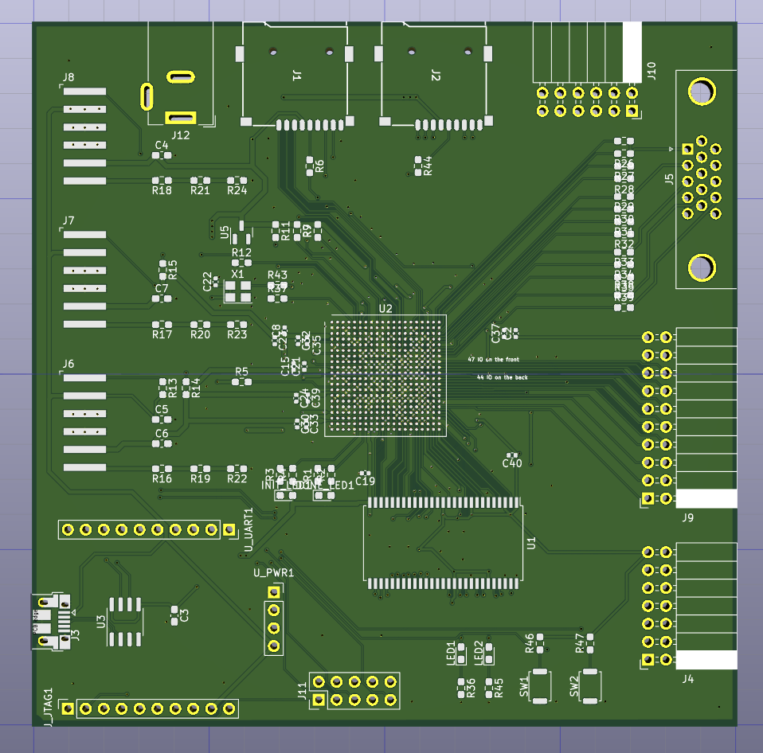
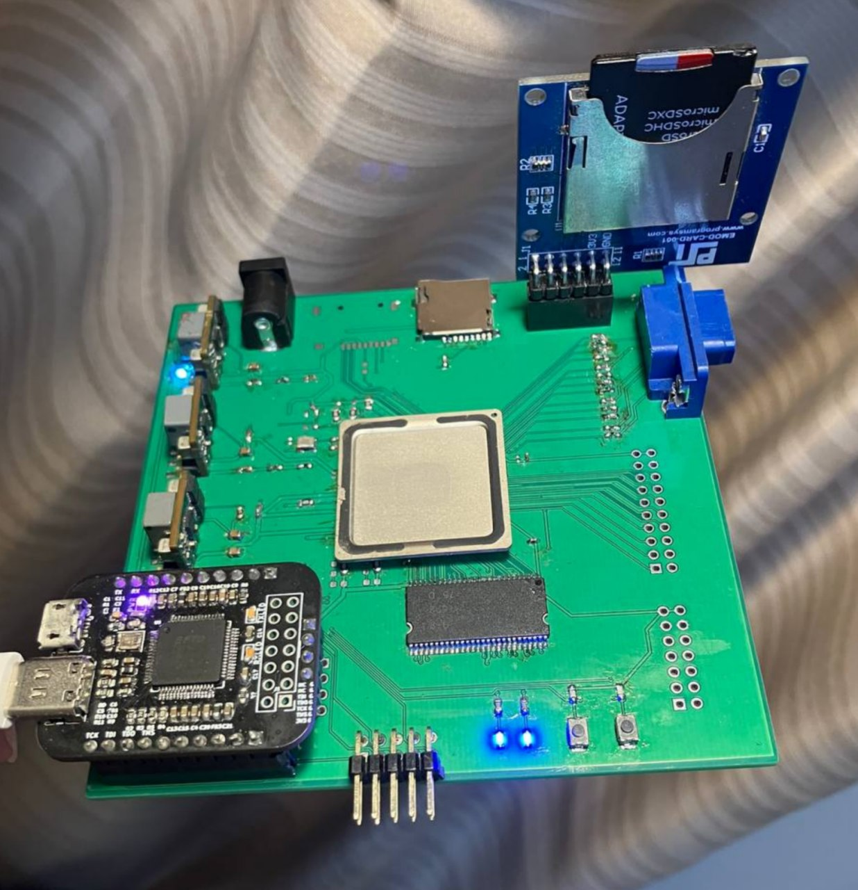

# Muzy-2
2-layer FPGA development board with ZYNQ 7010/7020 400-pin BGA.  
Pad size was shrinked due to clearance requirements -- JLCPCB 2-layer 5 mil line width, 0.5/0.3 mm via. 

## Working

PL(FPGA fabric) JTAG & bitstream downloading, SDRAM tested up to 110 MHz, 640x480 VGA, BTN/LED, PMOD

Loading PS(ARM cores) program via JTAG in Xilinx SDK, PS UART, PS SD card, PS EMIO

## Not Working

PL SD card -- probably due to no pullup resistors! A PMOD SD card module works.

PS load bitstream from SD card -- it seems impossible due to no big enough block of memory. Either SPI flash or DDR is required. 

JTAG at 30 MHz maybe not stable

## Gallery

Running with [self-designed JTAG/UART bridge](https://github.com/regymm/ymmcu-ft2232)

<!-- Minimum configuration with external power supply and just a few resistors -- back side empty! -->
