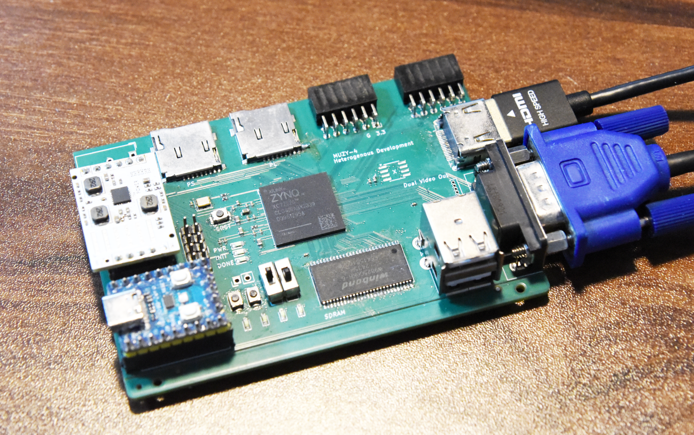
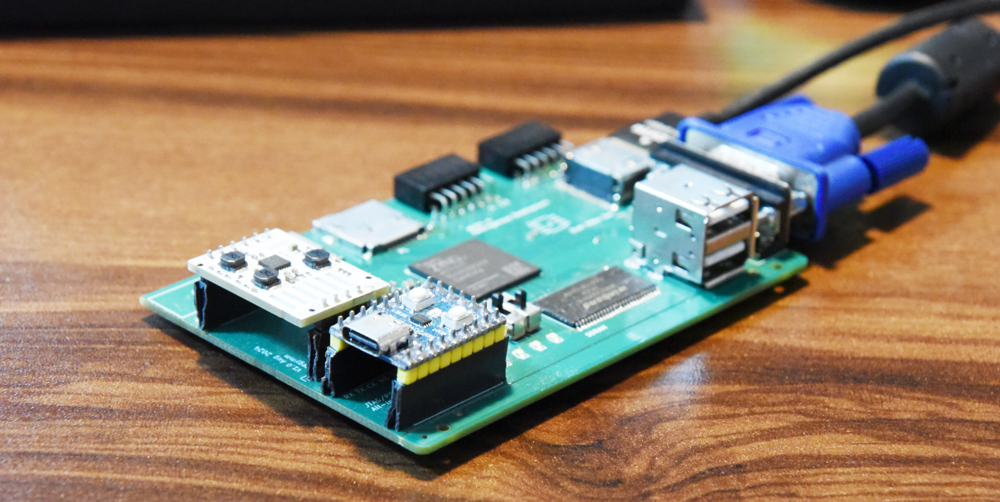
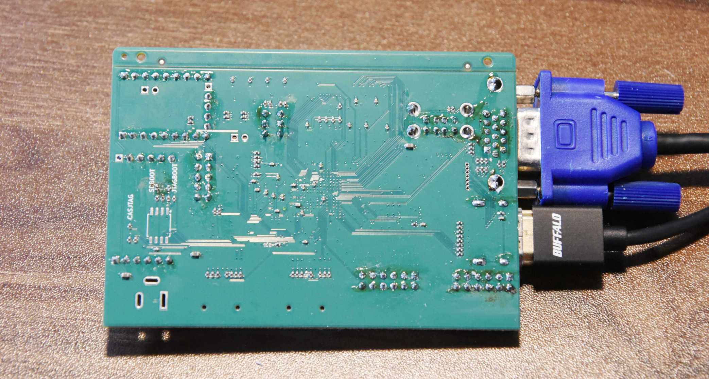

# MUZY

AMD/Xilinx ZYNQ 7010/7020 SoC as generic FPGA development board, no DDR -- cheaper than your Artix 7! 

## MUZY-2

[BGA on 2-layers? It's possible and verified!](muzy2.md)

## MUZY-4

[Now on sale!]()

**Hardware**

- Zynq 7020 (xc7z020-clg400-1)

- RP2040-based JTAG blaster, with DirtyJTAG / XVC Pico firmware, working with OpenFPGALoader and Vivado

- Dual SD Card PS + PL

- Dual Video Out HDMI + VGA 

- Dual USB Host

- Dual PMOD

- 2 switches, 2 buttons, 4 LEDs

- 256 Mb (32 MB) SDRAM

Should be perfect for SoC development & work as a handhold FPGA computer! 

Open-source [Zynq](https://github.com/regymm/GenZ)/[FPGA](https://github.com/OpenXC7) toolchains recommended! 

**Software**

Tested: [Zynq PS No-DDR SD Boot](https://github.com/regymm/GenZ/tree/master/examples/6-noddr-sdboot), [RISC-V SoC Linux booting from SD Card](https://github.com/regymm/quasiSoC/tree/master/rtl/hart_transplant/openla500), Dual video output

**Gallery**

Video: [Linux UART with dual graphics test output](https://www.youtube.com/shorts/H9cZ7YbqNOI)

Pictures: 

